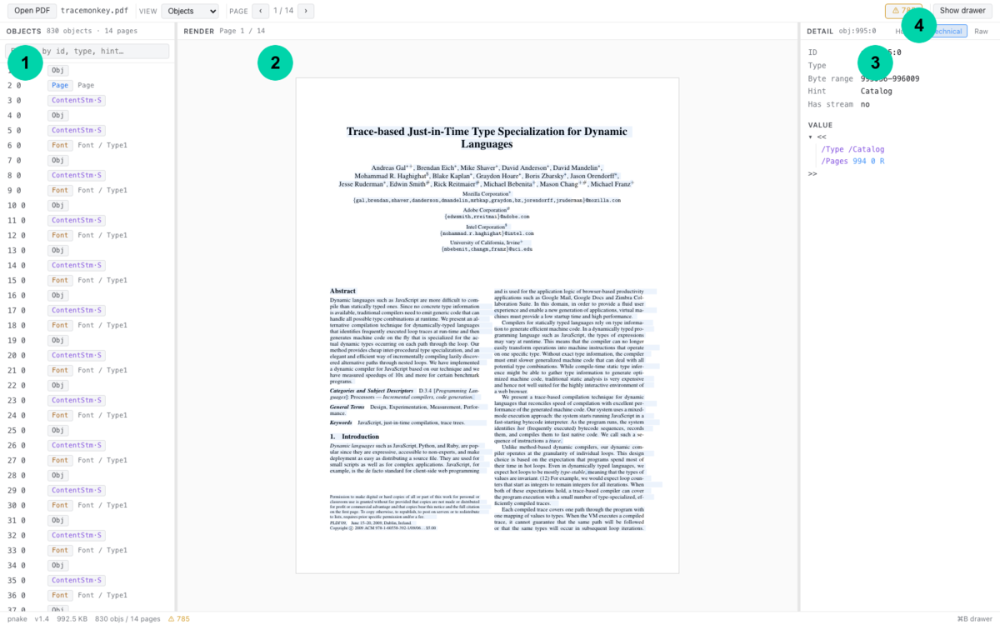
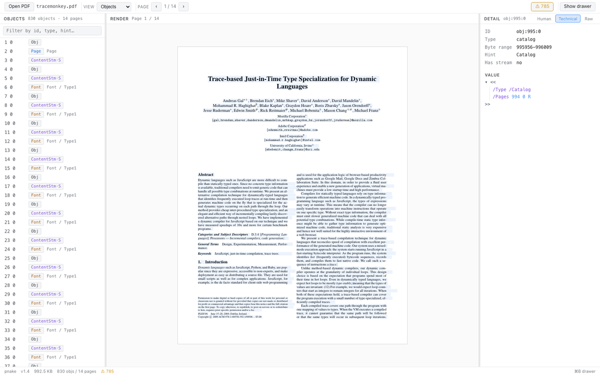
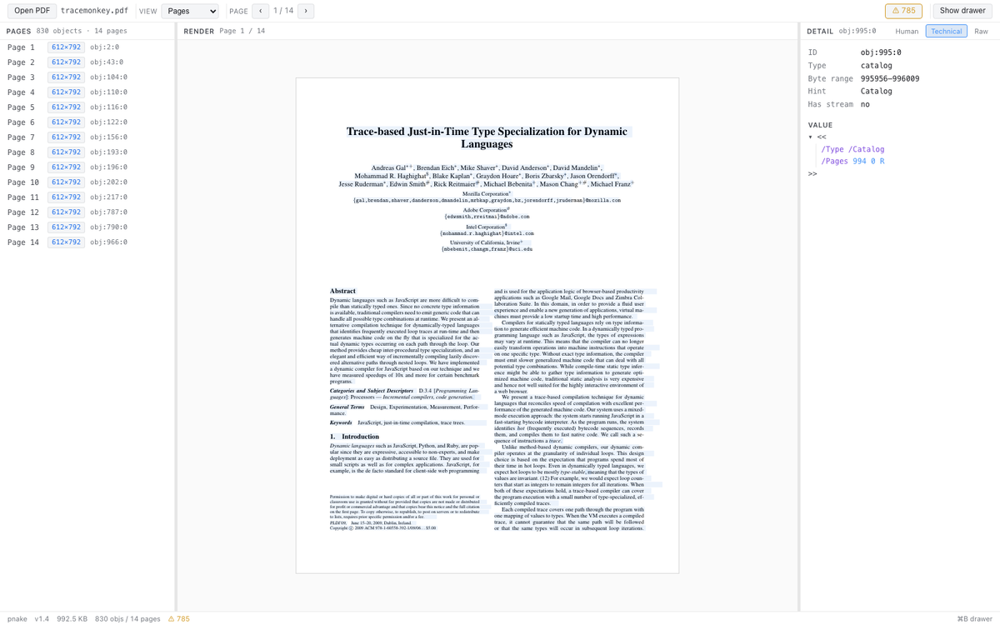
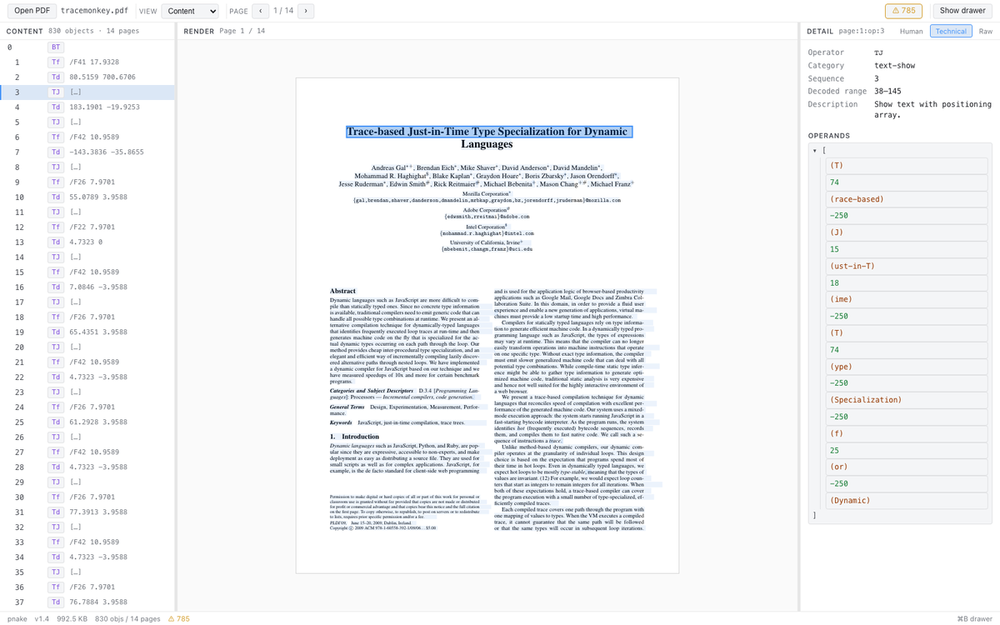
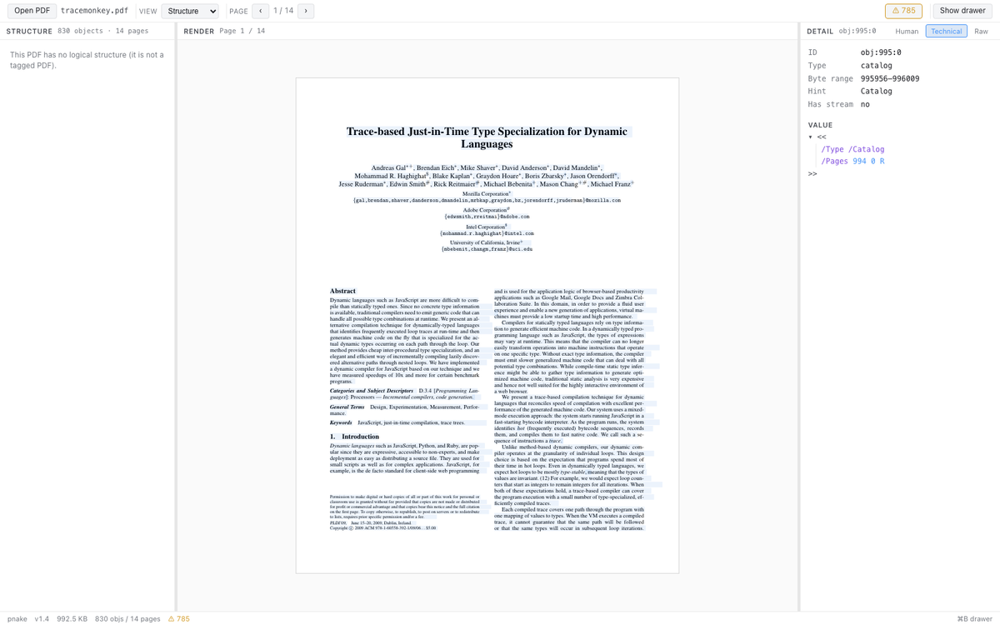
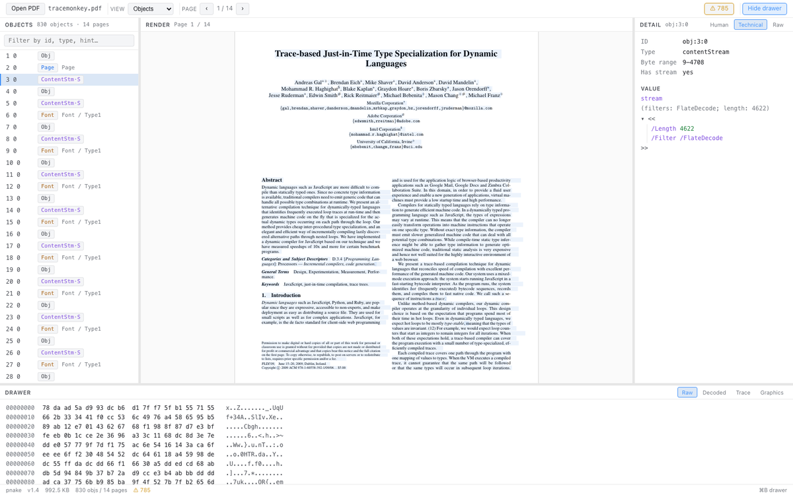

# pnake — PDF DevTools

PDF の中身を **ブラウザだけで** 解剖する DevTools 風インスペクタ。
描画ビューアではなく、構造を読むためのツール。Catalog / Pages / Resources / Content
stream を全部 lossless に追跡し、ノードをクリックすると元バイトまで辿れます。

<p align="center">
  
</p>

| | パネル | 用途 |
|---|---|---|
| **1** | Tree | Objects / Pages / Content / Structure / Warnings の 5 ビュー切替 |
| **2** | Render | PDF.js による描画(参照用)+ SVG overlay でクリック可能要素 |
| **3** | Detail | 選択ノードの Human / Technical / Raw 3 段説明 |
| **4** | Drawer | 下から開く raw / decoded バイトの hex view |

---

## なぜ pnake か

- **PDF を眺めるためのツールではない。理解するためのツール**。pdfinfo / pdfopen を一画面に集約し、専門家でない人にも「これは何を意味するか」を提示する。
- **アップロード不要**。すべての処理はブラウザ内（main thread + Web Worker）で完結。PDF はネットワーク越しに出ない。
- **lossless → decoded → explained の 3 段表現**。raw byte range まで切れない、provenance を絶対に失わない設計。詳細は [`docs/DATA_MODEL.md`](docs/DATA_MODEL.md)。

---

## Quick Start

```bash
pnpm install
pnpm dev       # http://localhost:5173
```

ブラウザで開き、ヘッダの **Open PDF** から任意の PDF を選択するか、ファイルをドラッグ&ドロップ。
すべての解析は手元のタブで完結し、ファイルがどこにも送信されません。

> [!NOTE]
> Node 22+ / pnpm 9+ を想定。Worker と OPFS の都合上、Chromium 系での動作確認が中心。

---

## 機能ハイライト

### Objects view — オブジェクトインデックス

xref から復元した全 indirect object を一覧。`/Type`・`/Subtype` を hint として併記し、
`·S` チップで stream を持つオブジェクトを示します。

<p align="center"></p>

### Pages view — ページ一覧

Page tree を平坦化し、MediaBox サイズ・回転・annotation 数を確認。クリックで該当 Page object へ即ジャンプ。

<p align="center"></p>

### Content view — content stream のタイムライン

そのページの operator を `q / BT / Tj / Q` の入れ子で表示。各 op をクリックすると Detail パネルに**人間向け説明**が出ます。仕様参照付き。

<p align="center"></p>

### Structure view — Tagged PDF

`/StructTreeRoot` をたどって論理構造を表示。MCID をクリックすると、その mark を発火させた content operator にジャンプ。

<p align="center"></p>

### Bottom drawer — Raw / Decoded byte hex

Stream オブジェクトを選んだまま下のドロワを開けば、filter 適用前 / 適用後の生バイトを hex でプレビュー。

<p align="center"></p>

---

## アーキテクチャ 1 枚絵

```
┌────────────────────────────────────────────────────────────┐
│  UI (main thread)                                          │
│   Shell  ─ Toolbar / Tree / Render / Detail / Drawer       │
│           AppContext (useReducer + 3 contexts)             │
│           ParserService — Worker / InProcess の DI         │
└─────────────────────────────────▲──────────────────────────┘
                                  │ typed RPC (RpcMethods map)
┌─────────────────────────────────┴──────────────────────────┐
│  Worker (parser-session.ts)                                │
│   ├─ parseStructure   (header / EOF / xref / 復旧)         │
│   ├─ loadObjectGraph  (indirect objects + ObjStm 展開)     │
│   ├─ buildDocumentGraph (Catalog / pages / AcroForm)       │
│   └─ collectFileInfo  (linearized / tagged / xfa / js)     │
└────────────────────────────────────────────────────────────┘

   PDF.js (描画専用) ←── 並列に走るが解析には使わない
```

依存方向は ESLint で機械的に守る:

- `ui/`     → `worker/pdf/**` を **import しない** → `core/` か `shared/` 経由
- `shared/` → 何にも依存しない (contract layer)

詳細は [`docs/ARCHITECTURE.md`](docs/ARCHITECTURE.md) / [`docs/DATA_MODEL.md`](docs/DATA_MODEL.md) / [`docs/DECISIONS.md`](docs/DECISIONS.md)。

---

## 開発

| Script | 用途 |
|---|---|
| `pnpm dev` | Vite dev server (HMR 付き) |
| `pnpm build` | プロダクションビルド (`dist/`) |
| `pnpm preview` | ビルド成果物をローカル配信 |
| `pnpm typecheck` | `tsc -b --noEmit` |
| `pnpm test` | Vitest (unit / integration) |
| `pnpm e2e` | Playwright e2e (`pnpm e2e:install` を初回先行) |
| `pnpm lint` / `pnpm lint:fix` | ESLint (flat config, strictTypeChecked) |
| `pnpm format` / `pnpm format:check` | oxfmt によるフォーマット |
| `pnpm capture:screenshots` | この README のスクリーンショットを再生成 |

### スタック

- React 19 / TypeScript 6 / Vite 8 / Vitest 4 / Playwright
- 描画は **pdfjs-dist 5**(canvas 出力のみ。解析は自前)
- Lint: ESLint 10 flat config + `typescript-eslint` strict + `import-x` + `jsx-a11y` + `@eslint-react` + `@vitest/eslint-plugin`
- Format: `oxfmt`(Prettier 互換、~10× 速い)

### ディレクトリ

```
src/
├── App.tsx / main.tsx
├── ui/           # main thread のみ (panels / state / services / overlay)
├── core/         # transport-agnostic な ParserSession
├── shared/       # IR 型 / RPC protocol / operator spec
├── worker/       # Worker entry + pdf/ パーサ群
└── pdfjs/        # PDF.js wrapper (描画専用)
```

---

## セキュリティ方針

入力 PDF はマルウェア相当のリスクを持つため、**絶対に行わない** 事を明示しています:

- PDF 内 JavaScript Actions の実行
- 外部 URL の自動 fetch
- Embedded files の自動展開
- フォントの OS 登録

巨大 PDF(500MB+)で UI を止めないために stream は lazy decode、decompression bomb 対策として展開後サイズ上限あり。詳細は [`docs/ARCHITECTURE.md`](docs/ARCHITECTURE.md) の "エラー設計" / "セキュリティ" 節。

---

## ロードマップ / 設計判断

- フェーズと DoD: [`docs/ROADMAP.md`](docs/ROADMAP.md)
- 直近のタスク: [`docs/TASKS.md`](docs/TASKS.md)
- 主要な設計判断ログ: [`docs/DECISIONS.md`](docs/DECISIONS.md)

---

## Contributing

PR / Issue 歓迎です。コードを書く前に:

1. `docs/ARCHITECTURE.md` と `docs/DATA_MODEL.md` を読む
2. `pnpm install && pnpm typecheck && pnpm test && pnpm e2e` が通る状態にする
3. 仕様変更(IR を増やす等)は同じ PR でドキュメントも更新する

PR description は git commit log の自然な拡張です。

---

## License

このリポジトリは個人/教育用途を想定した実験プロジェクトです。ライセンスは現状未確定。利用前に確認してください。
